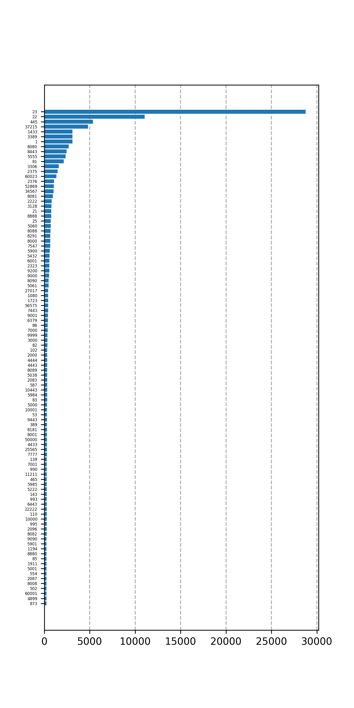

# port-statistics

A program to parse dmesg log file and draw barchart statistics with top scanned
ports.

## Run

```bash
$ journalctl --dmesg --grep '\[NFT' -ball > journal.txt
$ python main.py -i journal.txt -p TCP -o out.png --top 100
```

## Example


